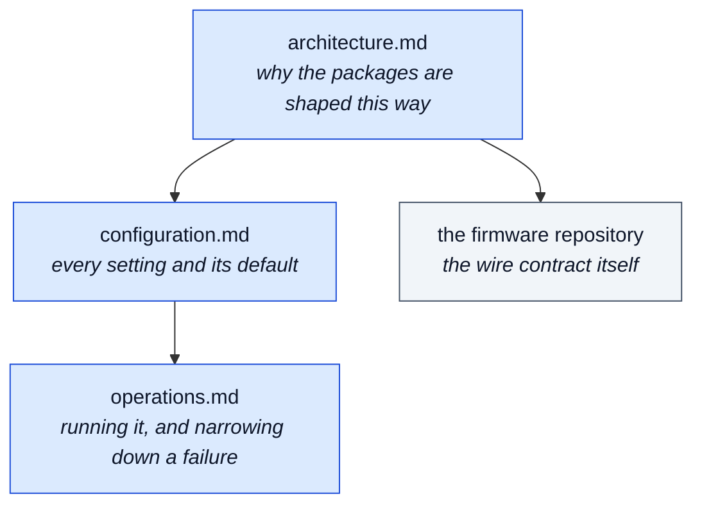

# Documentation

## Where to start

**Getting a robot talking.** The [README](../README.md#quick-start) Quick Start, then
[`configuration.md`](configuration.md) for the endpoints, then [`operations.md`](operations.md)
when something does not answer. Start in fixed-response mode — it removes every downstream
service from the request path and helps identify whether to investigate the device connection,
the gateway, or a configured provider.

**Building your own host on the packages.** [`architecture.md`](architecture.md) for what each
package owns and what it deliberately cannot see, then the README's
[Usage](../README.md#usage) for the seams. `TestKit` verifies your host against the same 13
checks used here, allowing a host to verify the wire requirements directly.

**Deciding whether to depend on this.** [`architecture.md`](architecture.md) and the README's
[Known Limitations](../README.md#known-limitations) describe the current constraints and
compatibility boundaries.

**Changing this repository.** [`CONTRIBUTING.md`](../CONTRIBUTING.md) describes the development
workflow and enforced design requirements; [`architecture.md`](architecture.md) explains why
those requirements exist.

**Writing custom firmware.** The authoritative wire contract is maintained in
[stackchan-atoms3r](https://github.com/kkdev92/stackchan-atoms3r/blob/main/docs/api/device-interface.md),
and `tools/device-sim --scenario reject` is the executable form of how a malformed request is
refused.

## Scope of each document

| Document | Owns | Does not cover |
|---|---|---|
| [`architecture.md`](architecture.md) | Package boundaries, the enforced rules, turn flow, the local-model layers, defenses, tests | How to set any specific value |
| [`configuration.md`](configuration.md) | Every setting, its default, and why the default is what it is | What to do when a downstream service is down |
| [`operations.md`](operations.md) | Starting it, health endpoints, metrics, deployment constraints, narrowing down a failure | Why the design is what it is |

The [firmware repository](https://github.com/kkdev92/stackchan-atoms3r) is authoritative for the
device wire contract, device HTTP API, and hardware. These documents summarize only the values
needed to configure or explain the gateway and link to the detailed firmware documentation.

Related documents live outside this directory. `eng/PACKAGE-README-FOOTER.md` is the shared
closing section for package READMEs, and [`CONTRIBUTING.md`](../CONTRIBUTING.md) describes the
development workflow and requirements enforced by tests.
