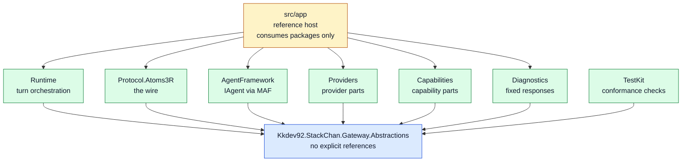
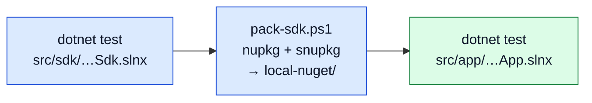
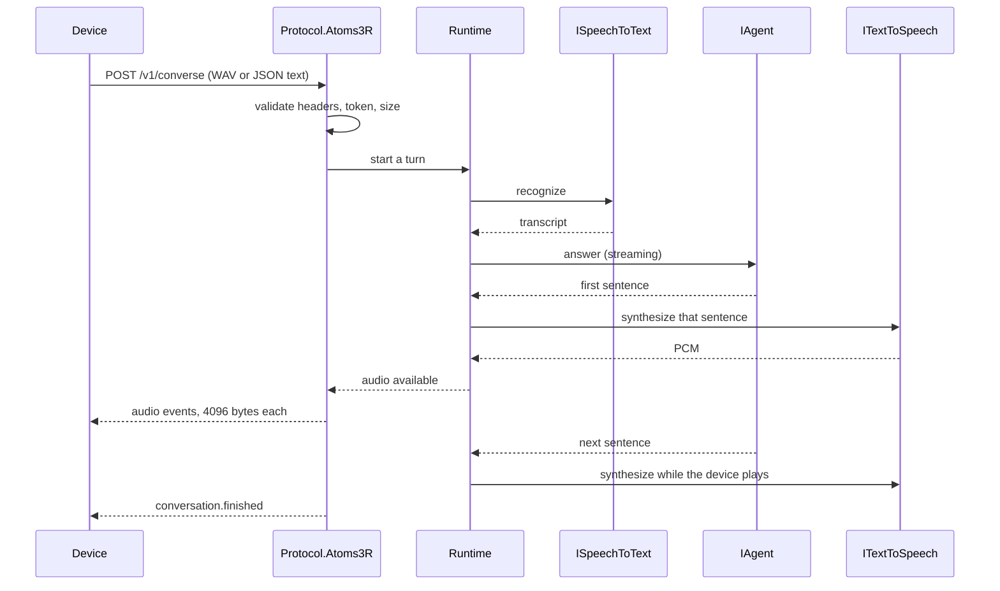

# Architecture

How this repository is laid out, and why. The authoritative device wire contract lives in the
[firmware repository](https://github.com/kkdev92/stackchan-atoms3r/blob/main/docs/api/device-interface.md).
This page repeats only the constraints needed to explain the gateway design.

## The shape of the problem

The device records three seconds of audio at 16 kHz, posts it to `/v1/converse`, and plays back
an SSE stream of audio events. The wire contract fixes the event names, envelope, 8,192-byte cap
on a single SSE line, 4,096 bytes of PCM per event, and 16 kHz signed 16-bit mono format.

The gateway components remain configurable while the firmware protocol remains fixed:

```text
Fixed firmware, extensible gateway
```

The package structure isolates that fixed protocol from configurable gateway behavior.

## Packages



Every package depends on `Abstractions` and on nothing else in this repository.
`Abstractions` itself has zero `PackageReference`, zero `ProjectReference`, and
zero `FrameworkReference`.

The flat graph lets consumers install the required packages without acquiring unrelated SDK
components through transitive dependencies.

### Automatically enforced

`ArchitectureInvariantTests` fails the build on any of 11 forbidden reference
directions. The ones that matter most:

| Forbidden | Why |
| --- | --- |
| `Runtime` → `AgentFramework` | The runtime must not know which agent framework is in use. `IAgent` is the seam |
| `Providers` → `Runtime` | Providers implement service access; turn orchestration remains in `Runtime` |
| `Capabilities` → `Providers` | Capabilities and speech providers are separate concerns, even when both use HTTP |
| ASP.NET types → `Runtime` | `HttpContext` reaching the runtime is how the wire shape leaks into orchestration |
| `src/app` → `src/sdk` by project | The reference host has zero `ProjectReference`. It consumes packages, so it proves the packages work |

`AppCompositionTests` enforces the package-reference rule.

## The verification chain



`build-all.ps1` runs those three steps and stops at the first failure. Step 3 is
not a formality: the reference host restores `Kkdev92.StackChan.*` from the local feed, so
packaging defects such as a missing type, an incorrect dependency, or a project that does not
pack are detected before publishing.

`nuget.config` maps `Kkdev92.StackChan.*` to the local feed only, so this path cannot
accidentally resolve against NuGet.org.

## One turn



The turn is driven by sentences, not by the whole reply. Synthesis starts on the
first complete sentence the model produces, one sentence ahead of playback, so the
robot starts talking while the model is still writing. Model generation and speech
synthesis usually dominate the time to first audio; the instrumentation described below
allows each deployment to measure both components.

The runtime never sees an SSE frame. It reports that audio is available; turning
that into `data: {...}` lines within the device's byte caps is `Protocol.Atoms3R`.

## The agent, and local models

An OpenAI-compatible endpoint is assumed. Some local-model endpoints represent tool calls and
optional parameters differently from hosted APIs. Three layers handle those compatibility
differences, stacked inside the agent:

```text
ChatClientAgent                       (Microsoft Agent Framework)
  FunctionInvokingChatClient          added by the framework
    CapabilityPrefetchChatClient      runs a capability on a trigger word
      TextToolCallChatClient          parses tool calls that arrive as body text
        MeasuredChatClient            time to first streamed chunk
          OpenAI chat client
```

| Layer | Compatibility difference handled |
| --- | --- |
| `TextToolCallChatClient` | The model writes a tool call into the message body instead of the tool-call field. Parsed back into a structured call |
| `CapabilityPrefetchChatClient` | Under `tool_choice: auto`, small models often decline to pick a tool at all. When the utterance hits a trigger word, the capability runs first and the result is handed over as context |
| `MeasuredChatClient` | Measures time to the first streamed chunk separately from total response generation time |

All of this stops at the package boundary. `IAgent` is what `Runtime` sees, and no
Microsoft Agent Framework type crosses it. Replacing the whole agent means
registering your own `IAgent`.

Capabilities are framework-independent in the same way. A capability is a plain
class with `[CapabilityAction]` on a method; `CapabilityToolProjector` converts
that into tool definitions in one direction only. Capability code never names an
`AITool`.

## What is swappable

All six interfaces in `Abstractions` are extension points. Five are registered
with `TryAddSingleton`, so registering your own first replaces the default;
`ICapability` uses a plain `AddSingleton` and accumulates.

The wire contract is not swappable, and there is deliberately no `IDeviceProtocol`
seam. The gateway's declared scope is AtomS3R stack-chan firmware. Custom firmware
is possible, but with one supported protocol an abstraction would add indirection without a
second contract to shape it. This decision can be revisited if another protocol is supported.

The concrete provider bindings (whisper.cpp, Piper-plus with VOICEVOX), the
capabilities (time, weather), and the default system prompt all live in `src/app`,
not in the SDK. The SDK carries no assumption about a language or a robot.

## Defenses

These defenses are included because the gateway accepts network input and downstream services
can fail or return unexpected data.

| | |
| --- | --- |
| Token, compared with a fixed-time primitive | For equal byte lengths, comparison time does not depend on matching content |
| Startup refusal | Unauthenticated plus non-loopback listening stops startup. Overriding it is an explicit setting, so it cannot happen by accident |
| Identifier allowlist | Device, boot, and conversation identifiers are length-capped and checked against a character allowlist |
| Body cap | 2 MB by default, sized for one WAV |
| Response cap | Downstream responses are read under a byte cap rather than buffered whole, so a runaway service cannot exhaust memory |
| Circuit breaker | Per downstream service. Counts only retryable failures, opens for a cooldown, then probes with one request |
| Admission gate | Concurrent turns are capped, and the check happens *before* the session is registered — otherwise refused turns still fill the session table |
| Session serialization | One turn per session at a time, so a second request for the same conversation cannot interleave |
| Idle eviction | Sessions are evicted after a timeout, and the table is capped |
| Log hygiene | Query strings are stripped from provider logs; the startup dump prints secret lengths |

## Observability

Six instruments use a BCL `Meter` named `StackChan.Gateway`, together with one
`ActivitySource`. OpenTelemetry exporters remain optional, and `dotnet-counters` can read the
`Meter` directly.

```text
stackchan.turn.duration            stackchan.provider.duration
stackchan.turn.first_audio         stackchan.provider.breaker.opened
stackchan.turns.active             stackchan.capability.calls
```

Measurement is a decorator (`ObservedTurnRuntime`), not a change to
`TurnRuntime`. The model is measured separately by `MeasuredChatClient`, because
the model does not go through the provider path and would otherwise be invisible.

Health is split by meaning rather than collapsed into one endpoint: `/health` (the
process is up), `/health/ready` (the host still accepts requests), `/health/providers`
(a cached probe of the downstream services). The probe result is cached because
`/health/providers` needs no token and would otherwise be a way to make the
gateway call outward repeatedly.

## Tests

| Layer | What it checks |
| --- | --- |
| Unit | Behavior of each package |
| Architecture | Forbidden reference directions, dependency boundaries, and the shared package README footer |
| Conformance | A host's raw SSE bytes against the 13 device-contract rules |
| Mutation | That every conformance rule reports the corresponding malformed stream |
| Composition | That the reference host holds zero `ProjectReference` to the SDK |
| Reference host | The host against the packed packages |
| Wire, end to end | `device-sim` scenarios, including malformed requests and disconnects |

Mutation tests feed malformed streams to each conformance rule and verify that
the expected violation is reported.

`device-sim` sends malformed inputs that the firmware does not produce, allowing those cases to
be tested independently of the device.
Microphone, speaker, expression, and emergency-stop behavior require real
hardware, so those checks run outside CI.
